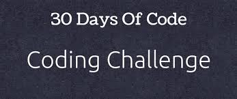

<div align="center">
   
</div>

# 30 Days of Code Challenge (HackerRank) 🚀


Welcome to my **30 Days of Code** challenge repository! This project contains solutions to the HackerRank challenge, where I tackle a new problem every day to improve my C++ skills and enhance my problem-solving abilities.

---

## Repository Structure 🗂️

- **DayXX/**: Each folder contains a solution for that day's challenge (e.g., `main.cpp`), along with any relevant test files.
- Well-organized for easy navigation and understanding.

---

## How to Use 🖥️

1. Navigate to a specific day's folder.
2. Compile and run the `main.cpp` file:
   ```bash
   g++ main.cpp -o dayXX
   ./dayXX
   ```

Enjoy the challenge and keep coding! 🎯

---

## Progress Tracker ✅

- [x] **Day 0**: Hello, World!
- [x] **Day 1**: Data Types
- [x] **Day 2**: Operators
- [x] **Day 3**: Intro to Conditional Statements
- [x] **Day 4**: Class vs. Instance
- [x] **Day 5**: Loops
- [x] **Day 6**: Let's Review
- [x] **Day 7**: Arrays
- [x] **Day 8**: Dictionaries and Maps
- [x] **Day 9**: Recursion 3
- [ ] **Day 10**: Binary Numbers
- [ ] **Day 11**: 2D Arrays
- [ ] **Day 12**: Inheritance
- [ ] **Day 13**: Abstract Classes
- [ ] **Day 14**: Scope
- [ ] **Day 15**: Linked List
- [ ] **Day 16**: Exceptions - String to Integer
- [ ] **Day 17**: More Exceptions
- [ ] **Day 18**: Queues and Stacks
- [ ] **Day 19**: Interfaces
- [ ] **Day 20**: Sorting
- [ ] **Day 21**: Generics
- [ ] **Day 22**: Binary Search Trees
- [ ] **Day 23**: BST Level-Order Traversal
- [ ] **Day 24**: More Linked Lists
- [ ] **Day 25**: Running Time and Complexity
- [ ] **Day 26**: Nested Logic
- [ ] **Day 27**: Testing
- [ ] **Day 28**: RegEx, Patterns, and Intro to Databases
- [ ] **Day 29**: Bitwise AND

---

## Contributing 🤝

Feel free to fork this repo, submit pull requests, and contribute to improving the solutions!

---

Happy coding! 😄